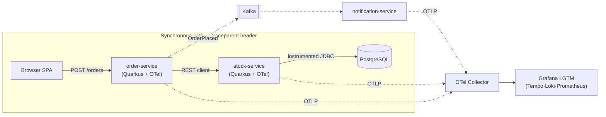

# Quarkus Distributed Tracing POC — Grafana LGTM + OpenTelemetry

Proof-of-concept for **end-to-end distributed tracing** in Java Quarkus microservices on Kubernetes: one trace ID spanning browser → REST services → SQL → async Kafka hop, with logs and metrics correlated to it in Grafana.



## Success criteria

| # | Demonstrates |
|---|---|
| S1 | One trace ID across browser → order-service → stock-service |
| S2 | SQL query visible as a child span (`db.statement`) |
| S3 | Every log line carries traceId; span → Loki logs jump works |
| S4 | Custom business span via `@WithSpan` |
| S5 | Async Kafka hop stitched into the same trace |
| S6 | Prometheus exemplars link latency histograms to traces |
| S7 | Whole system reproducible via ArgoCD from this repo — no `kubectl apply` |

## Stack

Quarkus 3.33 LTS (Java 21) · OpenTelemetry (traces, logs, metrics over OTLP) · OTel Collector · Grafana LGTM all-in-one · PostgreSQL · Kafka (single-pod KRaft) · ArgoCD + Kustomize · MetalLB + ingress-nginx · local registry on a Dev VM, images built with Jib and tagged by git SHA.

## Repository layout

```
services/           order-service, stock-service (Quarkus; more per phase)
deploy/
  base/             environment-agnostic manifests (observability, platform, apps)
  overlays/local    Vagrant-cluster overlay: MetalLB pool, nip.io hostnames, image tags
  overlays/eks*     AWS EKS overlays (Stage B, placeholder)
  argocd/           app-of-apps: local-root.yaml is the ONE manifest applied by hand
infra/
  devvm-registry/   plain-HTTP registry (Docker) on the Dev VM at 192.168.56.20:5000
  ansible/          CRI-O registry-trust playbook for the cluster nodes
Makefile            build-push (Jib → registry, tag = git SHA) and deploy (GitOps bump)
```

`docs/` and `documents/` (PRD, runbook, troubleshooting log) are kept local and untracked.

## Environment

| Component | Address |
|---|---|
| Dev VM (build host + registry) | `192.168.1.10` / `192.168.56.20` |
| Cluster (Vagrant, kubeadm, CRI-O, Calico) | control `192.168.56.10`, workers `.11` / `.12` |
| MetalLB pool | `192.168.56.240–250` |
| Grafana / API / OTLP ingress | `*.192.168.56.240.nip.io` |
| ArgoCD | NodePort `30002` on the control node |

## Bootstrap (once per cluster)

1. **Registry** on the Dev VM — see `infra/devvm-registry/README.md`
2. **Runtime trust** on the nodes — `ansible-playbook -i inventory.ini infra/ansible/registry-trust.yaml`
3. **ArgoCD** — `kubectl apply -f deploy/argocd/local-root.yaml` (the only imperative step; everything else reconciles from Git: MetalLB → ingress-nginx → observability + platform + apps)

## Daily loop

```bash
# on the Dev VM, after committing code
make build-push   # Jib-builds each service, pushes :<git-sha> to the registry
make deploy       # kustomize edit set image + commit + push → ArgoCD syncs
```

Then place an order and follow the trace:

```bash
curl -s -X POST http://api.192.168.56.240.nip.io/orders \
  -H 'content-type: application/json' -d '{"sku":"SKU-1","quantity":2}'
```

Grafana → Explore → Tempo → newest `order-service` trace: the waterfall shows `POST /orders`, the `validate-order` custom span, the nested `stock-service` call, and the SQL `SELECT` with its statement — one trace ID end to end.

## Status

- ✅ Phase 0 — platform foundation (registry, ArgoCD app-of-apps, MetalLB, ingress-nginx, OTel Collector, LGTM)
- ✅ Phase 1 — order-service + stock-service, one trace (S1) — *written; cluster verification in progress*
- ✅ Phase 2 — PostgreSQL, JDBC spans, OTLP logs, `@WithSpan` (S2–S4) — *written; pending verification*
- ⏳ Phase 3 — browser root span · Phase 4 — Kafka async hop (S5) · Phase 5 — exemplars (S6)
- ⏳ Stage B — EKS migration via `overlays/eks`
