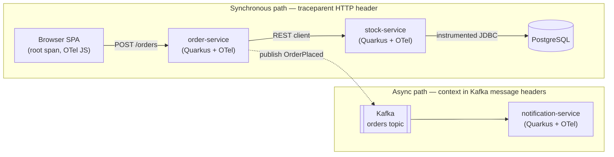
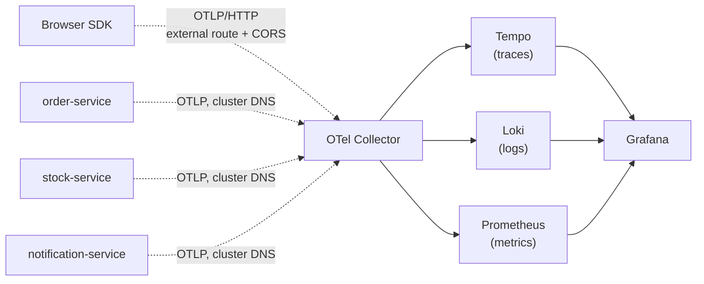
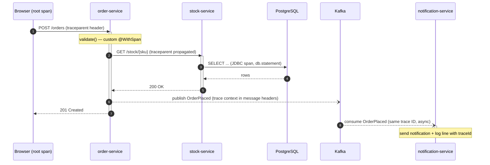

# PRD — Quarkus end-to-end distributed tracing POC

**Version:** 1.1.1 (final consistency pass: S7/D8 alignment, D3 access wording, eks-demo overlay in repo layout, stale risk rows resolved)
**Owner:** Adhito
**Status:** ✅ Ready for handoff to Claude Code / engineering team
**Date:** 2026-07-18

---

## 1. Problem statement

Modern payment and platform systems span browser frontends, multiple backend microservices, databases, and async messaging. When a request is slow or fails, logs alone cannot answer "where did the time go?" or "which downstream call failed?" across service boundaries.

This POC exists to build hands-on understanding of **distributed tracing with OpenTelemetry in Java Quarkus**, deployed on Kubernetes, covering the complete journey:

> Browser click → Service A → Service B → SQL query → async Kafka hop — all visible as **one trace** in Grafana, with logs and metrics correlated to it.

The primary goal is **learning**, the secondary goal is producing a reference architecture and reusable manifests that could inform future production observability work.

## 2. Success criteria

The POC is complete when all of the following are demonstrable:

| # | Criterion | Verified by |
|---|-----------|-------------|
| S1 | A single trace ID spans browser → order-service → stock-service | Grafana Tempo waterfall shows spans from all three, one trace ID |
| S2 | The SQL query to PostgreSQL appears as a child span with the statement visible | JDBC span with `db.statement` attribute under stock-service |
| S3 | Every application log line carries `traceId`/`spanId`; trace-to-logs jump works | Click a span in Grafana → see the exact Loki log lines for that span |
| S4 | A custom business span (`@WithSpan`) appears in the trace tree | Manually annotated method visible as its own span |
| S5 | An async Kafka hop is stitched into the same trace | Producer span in order-service, consumer span in notification-service, same trace ID |
| S6 | Metrics exemplars link a Prometheus histogram to a trace | Click an exemplar dot on a latency panel → jump to that trace |
| S7 | Everything runs on the target Kubernetes cluster from declarative manifests | ArgoCD sync from a clean cluster reproduces the whole system (per D8; no imperative `kubectl apply` as the standard path) |

## 3. Non-goals

Explicitly out of scope for this POC:

- Production hardening: HA collectors, persistent trace storage sizing, retention policies
- Sampling strategies (head/tail sampling) — everything is sampled at 100%
- Authentication/authorization on any component
- Multi-cluster or multi-tenant concerns
- Alerting rules and SLO definitions
- Performance/load testing of the tracing pipeline itself
- CI/CD pipeline (Stage A uses the Makefile-driven GitOps loop per D9; a real pipeline to ECR is a Stage B backlog item)

## 4. Architecture overview

### 4.1 Request path (instrumented)

```
[Browser SPA]
  |  fetch + traceparent header (W3C Trace Context)
  v
[order-service]  (Quarkus, REST)
  |  REST client + traceparent          \--> [Kafka topic: orders] --> [notification-service]
  v                                            (context in message headers)
[stock-service]  (Quarkus, REST)
  |  instrumented JDBC datasource
  v
[PostgreSQL]
```

Mermaid equivalent (renders on GitHub/GitLab):



### 4.2 Telemetry path (out-of-band)

```
Browser SDK ----OTLP/HTTP (external route + CORS)----\
order-service --OTLP (cluster DNS)--------------------+--> [OTel Collector] --> [Tempo]   (traces)
stock-service --OTLP (cluster DNS)--------------------/                     --> [Loki]    (logs)
notification-service --OTLP (cluster DNS)------------/                      --> [Prometheus] (metrics)
                                                                                  |
                                                                            [Grafana] (UI, correlation)
```

Mermaid equivalent:



Key principle: telemetry export never sits in the request path. Spans are batched and exported asynchronously; if the collector is down, requests still succeed.

### 4.3 End-to-end sequence (one order, one trace)



### 4.4 Expected trace waterfall (acceptance view in Grafana Tempo)

This is what a successful end-to-end trace looks like. Indentation = parent-child span nesting; horizontal position = time. All bars share **one trace ID**.

```
time ──────────────────────────────────────────────────────────────►

Browser POST /orders (root)   ████████████████████████████████████
├─ order-service /orders        ██████████████████████████████
│  ├─ validate (@WithSpan)        ███                              (S4)
│  ├─ REST client → stock              ██████████████
│  │  └─ stock-service /stock            ████████████             (S1)
│  │     └─ SQL SELECT stock                ██████                (S2)
│  └─ kafka publish orders                            ██
└─ notification-service consume                          █████████ (S5)
                                                         ▲
                                        starts AFTER the browser
                                        response — async, same trace
```

Mapping to success criteria: S1 = browser + both services under one trace ID; S2 = the SQL child span; S4 = the custom `@WithSpan` bar; S5 = the async consumer bar that outlives the HTTP request. S3 (log correlation) is verified by clicking any span → jumping to its Loki log lines. S6 (exemplars) is verified from the opposite direction: latency panel → exemplar dot → this trace.

### 4.5 Kubernetes layout

| Namespace | Workloads |
|-----------|-----------|
| `tracing-poc` | order-service, stock-service, notification-service, frontend (nginx), PostgreSQL, Kafka |
| `observability` | OTel Collector, Grafana LGTM stack (all-in-one for POC) |

External access (from laptop/browser), per D3 — all via **ingress-nginx** backed by MetalLB (`192.168.56.240–250`) with nip.io hostnames:
- Frontend
- order-service API (called by browser fetch)
- OTel Collector OTLP/HTTP receiver (port 4318) — **required** for browser span export, with CORS configured
- Grafana UI

## 5. Components

### 5.1 order-service (Quarkus)

- REST endpoint `POST /orders` — the entry point the browser calls
- Calls stock-service via MicroProfile REST Client (auto-propagates context)
- Publishes an `OrderPlaced` event to Kafka via SmallRye Reactive Messaging
- Extensions: `quarkus-rest`, `quarkus-rest-client`, `quarkus-opentelemetry`, `quarkus-messaging-kafka`, `quarkus-micrometer-registry-prometheus`
- One business method annotated `@WithSpan` (e.g. order validation) to demonstrate manual instrumentation

### 5.2 stock-service (Quarkus)

- REST endpoint `GET /stock/{sku}` and `POST /stock/reserve`
- PostgreSQL via instrumented JDBC (`quarkus-opentelemetry` + datasource telemetry enabled) — produces `db.*` spans including the SQL statement
- Same core extension set as order-service (minus Kafka)

### 5.3 notification-service (Quarkus)

- Consumes `OrderPlaced` from Kafka
- Exists purely to demonstrate async context propagation via Kafka message headers
- Logs a "notification sent" message — used to verify log-trace correlation on the async branch

### 5.4 Frontend

- Minimal static SPA (plain JS or lightweight framework), served by nginx
- OpenTelemetry JS SDK: `@opentelemetry/sdk-trace-web`, fetch instrumentation, W3C trace context propagator, OTLP/HTTP exporter
- Generates the **root span** on user interaction (button click → place order)
- Injects `traceparent` into fetch calls to order-service

### 5.5 PostgreSQL

- Single instance, simple schema: `stock(sku, name, quantity)`
- Seeded with sample data via init job or init script

### 5.6 Kafka

- **Per D6:** minimal single-pod KRaft deployment — one Kafka container in combined broker + KRaft controller mode, plain Deployment + Service (~60 lines of YAML), plaintext listener (POC-internal only)
- One topic: `orders`, created via app auto-create or an init job
- No operator, no HA, no TLS — deliberately; Strimzi migration is a backlog item (section 11.1)

### 5.7 Observability stack

- **OTel Collector** (Deployment): OTLP gRPC + HTTP receivers; CORS configured on the HTTP receiver for the frontend origin; pipelines routing traces→Tempo, logs→Loki, metrics→Prometheus remote write (or Prometheus scrapes services directly — decide in design detail)
- **Grafana LGTM all-in-one** (single Deployment for POC): Loki + Grafana + Tempo + Prometheus in one pod. Graduation path: replace with individual Helm charts later
- **Grafana provisioning**: datasources pre-wired with trace-to-logs (Tempo→Loki via traceId) and exemplar support (Prometheus→Tempo)

## 6. Cross-cutting configuration

### 6.1 Context propagation

- W3C Trace Context (`traceparent`/`tracestate`) everywhere — default in both OTel JS and Quarkus
- HTTP hops: automatic via instrumented clients/servers
- Kafka hop: automatic via SmallRye Reactive Messaging OTel integration (context in message headers)
- CORS on order-service must allow the `traceparent` header from the frontend origin

### 6.2 Log correlation

- Quarkus JSON logging enabled; log output includes `traceId` and `spanId` (MDC-injected by the OTel extension); console/stdout logging stays on so `kubectl logs` keeps working
- **Log shipping (per D5): OTLP log export** from Quarkus through the existing collector to Loki — traceId/spanId travel as native OTel log record fields, no parsing needed
- Quarkus deployments carry the pod label `logs.export/otlp: "true"` from day one, so a future node-collection DaemonSet (Stage B option, for non-app logs) can exclude these pods and avoid duplicate ingestion
- Grafana Tempo datasource configured with "trace to logs" linking on `traceId`

### 6.3 Metrics and exemplars

- Micrometer + Prometheus registry in each Quarkus service
- HTTP server request histograms with exemplars enabled, carrying trace IDs
- Grafana panel demonstrating click-through from exemplar to trace

### 6.4 Build & delivery workflow (per D8/D9)

- **Environment topology:** Windows laptop (editor, code mounted into Dev VM) → Dev VM (build + registry, Podman; NICs on `192.168.1.10` + `192.168.56.20` per D10) → K8s cluster VMs (control `192.168.56.10`, workers `.11`/`.12`); all VM disks on external SSD
- **Registry:** `docker.io/library/registry:2` under **Podman** on the Dev VM at `192.168.56.20:5000`, data volume on the VM disk; persisted across reboots via systemd unit/Quadlet; containerd `hosts.toml` trust config pushed to all worker nodes by Ansible; optional second instance as a Docker Hub pull-through cache
- **Build (on the Dev VM):** `mvn package -Dquarkus.container-image.build=true -Dquarkus.container-image.push=true` with `quarkus-container-image-jib` (daemonless — independent of Podman/Docker); `quarkus.container-image.registry=192.168.56.20:5000`, `quarkus.container-image.insecure=true`; images tagged with the git SHA
- **Deploy loop:** Makefile target = build+push → `kustomize edit set image` in the target overlay → git commit/push → ArgoCD auto-sync → nodes pull from the Dev VM registry
- **Network prerequisite (Phase 0 pre-work, per D10):** add the second NIC (`192.168.56.20`) to the Dev VM Vagrantfile and reload; then from a cluster node, `curl http://192.168.56.20:5000/v2/_catalog` must return JSON
- **ArgoCD:** one Application per overlay (`local`, later `eks`, plus on-demand `eks-demo`); auto-sync + prune for `local`
- **Known friction:** vboxsf shared-folder I/O can slow Maven builds; if so, clone the repo onto the VM-native disk and edit via VS Code Remote-SSH
- **Stage B:** images move to ECR; CI pipeline (e.g. GitHub Actions) replaces the Makefile trigger — see backlog

## 7. Phased delivery plan

Delivery is split into **two stages across two environments**. Stage A proves everything end-to-end on the existing local cluster; Stage B migrates the working system to AWS EKS with minimal manifest changes (Kustomize overlays). Application code is expected to be **identical** across stages — only deployment configuration differs.

### Stage A — Local (Vagrant/Ansible cluster)

**Phase 0 — Platform foundation**
Pre-work per D10: add the Dev VM's second NIC (`192.168.56.20`), bump Kubernetes in settings.yaml to ~1.33/1.34 (+ Calico compatibility check), fix the ArgoCD provisioner condition bug (K8s Vagrantfile line 130), rebuild the cluster (1 control plane `192.168.56.10` + 2 workers `.11`/`.12`). Then: **registry on the Dev VM + containerd trust config via Ansible (D9)**; **ArgoCD (pre-provisioned by cluster bootstrap, NodePort 30002) bootstrapped with the repo's Applications (D8)**; MetalLB installed with pool `192.168.56.240–250`; ingress-nginx deployed via `Service: LoadBalancer`; `observability` namespace with OTel Collector + LGTM stack; Grafana reachable from the laptop browser via ingress hostname (nip.io or /etc/hosts). *Exit: `curl http://192.168.56.20:5000/v2/_catalog` returns JSON from a cluster node; Grafana loads through the ingress; collector healthy; ArgoCD showing all apps synced; a test image pushed to and pulled from the local registry.*

**Phase 1 — Two services, one trace (S1)**
order-service and stock-service deployed (no DB yet, stock-service returns stub data); OTLP export to collector over cluster DNS. *Exit: one trace ID spanning both services visible in Tempo.*

**Phase 2 — Database, logs, custom spans (S2, S3, S4)**
PostgreSQL deployed, stock-service wired to instrumented JDBC; JSON logging with traceId to Loki; trace-to-logs configured in Grafana; `@WithSpan` added. *Exit: SQL span visible; span→logs jump works.*

**Phase 3 — Browser root span (S1 extended)**
Frontend deployed; collector OTLP/HTTP exposed via ingress with CORS; browser generates root span and propagates to order-service. *Exit: trace begins in the browser.*

**Phase 4 — Async hop (S5)**
Kafka + notification-service deployed; order-service publishes event. *Exit: async consumer span in the same trace.*

**Phase 5 — Exemplars (S6)**
Micrometer exemplar configuration; Grafana dashboard with exemplar-enabled latency panel. *Exit: click exemplar → trace.*

### Stage B — AWS EKS

**Phase 6 — EKS migration**
Provision EKS cluster (Terraform, per existing EKS provisioning patterns); create `overlays/eks` patching hostnames, storage classes, and load balancer configuration; deploy the full system unchanged at the application level. *Exit: all success criteria S1–S6 re-verified on EKS.*

EKS-specific decisions deferred to Phase 6 design:
- **Ingress controller:** ingress-nginx behind an NLB (maximum parity with Stage A — recommended) vs. AWS Load Balancer Controller with ALB (more AWS-native, different annotations)
- **Browser reachability:** RESOLVED as D4 — hybrid model: SSM port-forward tunnels for daily work, on-demand IP-allowlisted internet-facing NLB overlay for demos (cost comparison in Appendix A)
- **Storage:** EBS CSI storage class for PostgreSQL/Kafka/Tempo persistence vs. keeping everything ephemeral (acceptable for POC)

Each phase is independently demoable. S7 (declarative reproducibility) is continuous — every phase adds manifests, never `kubectl edit`.

## 8. Repository structure (proposed)

```
quarkus-tracing-poc/
├── services/
│   ├── order-service/
│   ├── stock-service/
│   └── notification-service/
├── frontend/
├── deploy/
│   ├── base/
│   │   ├── observability/   # collector, LGTM, grafana provisioning
│   │   ├── platform/        # postgres, kafka
│   │   └── apps/            # service + frontend manifests, ingress
│   ├── overlays/
│   │   ├── local/           # MetalLB pool, nip.io hostnames, local storage
│   │   ├── eks/             # NLB config, EKS hostnames, EBS storage class
│   │   └── eks-demo/        # on-demand internet-facing NLB overlay (D4) — synced only for demos
│   └── argocd/              # Application manifests, one per overlay (required per D8)
└── docs/
    ├── prd.md
    └── runbook.md           # how to demo each success criterion
```

Environment-agnostic manifests live in `base/`; overlays patch only hostnames, storage classes, and load balancer specifics. Ingress resources are byte-identical between environments apart from hostnames and controller annotations.

## 9. Risks and mitigations

| Risk | Mitigation |
|------|------------|
| Browser → collector CORS/networking friction (most common failure point) | Phase 3 isolated; verify collector OTLP/HTTP externally with curl before wiring the SDK |
| Local cluster resource pressure (LGTM + Kafka + Postgres + 4 apps) | **Downgraded per D10(e):** workers provide 16 GB schedulable (2 × 4 vCPU/8 GB) — comfortable headroom; still use the all-in-one LGTM image, single-pod Kafka, and modest resource requests; verify laptop physical RAM covers the 32 GB total VM allocation |
| ingress-nginx retired upstream (March 2026): no further releases/patches | Acceptable for the POC (existing deployments keep working); backlog item to evaluate Gateway API or an alternative controller before any productionization of this reference architecture |
| Local↔EKS Kubernetes version skew (settings.yaml pinned 1.29, long EOL; EKS standard support ~1.33–1.36) | Resolved by D10(c): bump local cluster to ~1.33/1.34 at Phase 0 rebuild; re-verify against EKS's supported versions at Phase 6 |
| Log shipping approach ambiguity (OTLP logs vs. log collection) | Resolved by D5: OTLP export owns app logs; future DaemonSet excluded via the `logs.export/otlp` pod label |
| Version drift between OTel JS SDK, Quarkus OTel, and collector | Resolved by D7: Quarkus 3.33 LTS BOM manages Java-side versions; OTel JS pinned to one 2.x train; images pinned to exact tags at Phase 0; all recorded in runbook |
| Trace breaks silently (orphan traces) | Runbook includes a "propagation debug" section: check traceparent headers at each hop |

## 10. Decision log

| # | Decision | Rationale | Date |
|---|----------|-----------|------|
| D1 | **Cluster:** existing local Kubernetes (Vagrant + Ansible, 1 CP + 2–3 workers) for Stage A; **AWS EKS** for Stage B | Reuses a realistic multi-node cluster already in place; EKS is the target production-like environment | 2026-07-18 |
| D2 | **Two-stage delivery:** validate everything locally first, then migrate to EKS via Kustomize overlays with unchanged application code | De-risks EKS costs/complexity; forces environment-portable manifests | 2026-07-18 |
| D3 | **External access: ingress-nginx** in both environments; locally backed by **MetalLB** (`Service: LoadBalancer` with a host-only network IP pool) + nip.io hostnames, on EKS backed by an NLB (ALB controller evaluated in Phase 6) | ingress-nginx works identically on bare-metal and EKS; MetalLB gives local LoadBalancer parity so Ingress manifests stay byte-identical apart from hostnames | 2026-07-18 |
| D4 | **EKS browser access: hybrid model.** Default working mode is **SSM port-forward tunnels** through the existing bastion (Rp 0 extra cost, cluster stays private); an **internet-facing NLB overlay** (IP-allowlisted via security group) is synced on-demand for team demos and true RUM-path validation, then pruned. See Appendix A for the full cost comparison. | Daily loop is free and secure; demo mode costs ~Rp 540/hour (~USD 0.03) only when running; avoids ~Rp 360k–505k/month (~USD 20–28) of always-on LB spend on an unauthenticated POC | 2026-07-18 |
| D5 | **Log pipeline: OTLP export (app-push)** — Quarkus ships log records over OTLP through the existing collector, with traceId/spanId as native fields. Console/stdout logging stays on for `kubectl logs`. A node-collection DaemonSet (filelog) may be added later (likely Stage B) for non-app logs; to keep that purely additive, Quarkus deployments carry a `logs.export/otlp: "true"` pod label from day one so a future DaemonSet can exclude them and avoid duplicate ingestion. | Near-zero config, native trace-log correlation (core POC objective), no new infrastructure; coexistence with the production-standard DaemonSet pattern is pre-designed via the exclusion label | 2026-07-18 |
| D6 | **Kafka: minimal single-pod KRaft deployment** (combined broker + controller, plain Deployment + Service, plaintext listener, topics via app auto-create or init job) in both stages. Strimzi operator migration parked in the backlog as a dedicated future exercise. | POC objective is trace propagation *through* Kafka (S5), not Kafka operations; single pod costs ~512 MB–1 GB vs ~1.5–2 GB+ for Strimzi on an already-loaded local cluster; running in minutes vs half a day of operator setup; identical manifests across local and EKS overlays | 2026-07-18 |
| D7 | **Version pinning:** Quarkus **3.33 LTS** (via `io.quarkus.platform:quarkus-bom:3.33.x`) on **Java 21**; Java-side OTel SDK versions are BOM-managed (never pinned separately); frontend pins the latest **OTel JS 2.x** at Phase 3 start, with all `@opentelemetry/*` packages on the same release train; collector/LGTM/Kafka/PostgreSQL container images pinned to exact tags (never `latest`) at Phase 0 and recorded in the runbook. | 3.33 LTS is the current production-recommended line, supported to Mar 2027 (covers both stages; old LTS 3.27 dies Sep 2026); BOM management guarantees internally consistent OTel Java versions; OTel JS 2.x is the active development line (browser instrumentation still officially experimental — acceptable for POC); exact image tags make S7 reproducibility real | 2026-07-18 |
| D8 | **ArgoCD in scope from Phase 0.** All manifests delivered as ArgoCD Applications (one per Kustomize overlay) from the first deploy; no imperative `kubectl apply` as the standard path. | Zero learning cost (daily tooling); makes S7 continuously verified instead of aspirational; the D4 demo-overlay sync/prune lifecycle is natively an ArgoCD workflow | 2026-07-18 |
| D9 | **Image build & delivery (Stage A): local registry, no CI pipeline.** A `registry:2` container runs **on the Dev VM at `192.168.56.20:5000`** (via a second NIC added to the Dev VM on the cluster's `192.168.56.0/24` private network — see D10; the original `192.168.1.10` NIC is retained; registry data on the VM disk → external SSD), run under **Podman** (fully-qualified image `docker.io/library/registry:2`, persisted across reboots via a systemd unit / Quadlet since rootless Podman doesn't honor `--restart=always` at boot); containerd on all worker nodes trusts it via Ansible-provisioned `hosts.toml`. Builds run **on the Dev VM** (code mounted at `/home/vagrant/workspace-app`) using Quarkus **Jib** — daemonless, so the Docker-vs-Podman choice never affects builds — with `quarkus.container-image.registry=192.168.56.20:5000`, `quarkus.container-image.insecure=true`, images tagged with the git SHA; a Makefile target bumps the tag via `kustomize edit set image` and commits — ArgoCD syncs, nodes pull over the local network. **Phase 0 verification step:** from a cluster node, `curl http://192.168.56.20:5000/v2/_catalog` must return JSON, proving Dev VM ↔ cluster network reachability (Vagrantfiles verified 2026-07-18: cluster and Dev VM were on separate host-only subnets — fixed by the second NIC per D10). Optional: second registry instance as a Docker Hub pull-through cache. Stage B switches to **ECR** with a real CI pipeline (backlogged). *Known risk: vboxsf shared-folder I/O may slow Maven builds; mitigation is cloning repo onto the VM-native disk (edit via Remote-SSH) if needed.* | App images never traverse the internet or Disk C: (Dev VM disk lives on the external SSD); the Dev VM is Linux-native with Podman already in use; GitOps contract preserved (Git the source of truth, ArgoCD the reconciler); Kubernetes nodes only pull images — something must push to a registry, and the Dev VM is the cheapest place for it | 2026-07-18 |
| D10 | **Environment verified against actual Vagrantfiles + settings.yaml; required Phase 0 pre-work recorded.** (a) **Network unification:** cluster nodes are on `private_network` 192.168.56.10/.11/.12; Dev VM is on a *separate* host-only network at 192.168.1.10 — isolated by VirtualBox, so cross-reachability did not exist. Fix: add a second NIC to the Dev VM (`config.vm.network "private_network", ip: "192.168.56.20"`). (b) **MetalLB pool concretized:** `192.168.56.240–192.168.56.250` (clear of nodes .10–.12 and the Dev VM .20). (c) **Kubernetes bump:** settings.yaml pins `1.29.0-*` (long EOL); bump to ~1.33/1.34 at Phase 0 rebuild to align with EKS standard support (currently ~1.33–1.36) and avoid a 5-minor-version local↔EKS skew; re-check Calico (3.28) compatibility when bumping. (d) **ArgoCD 2.14.8 is already provisioned by the cluster bootstrap** (NodePort 30002) — Phase 0 only bootstraps Applications; note the K8s Vagrantfile line-130 bug where the ArgoCD provisioner condition checks `software.dashboard` instead of `software.argocd` (works only while dashboard is enabled — fix the condition). (e) **Worker capacity confirmed:** 2 × (4 vCPU / 8 GB) = 16 GB schedulable — resource-pressure risk downgraded; total estate is 20 vCPU / 32 GB across 4 VMs, verify laptop physical RAM covers it. | Grounding the PRD in the real environment converted one silent Phase 0 blocker (network isolation) and one Stage B landmine (version skew) into explicit, cheap pre-work items | 2026-07-18 |

## 11. Open questions

**All resolved** — see the decision log (section 10, D1–D10).

### 11.1 Backlog (deferred, not blocking)

- **EKS full cost analysis** — control plane (~$0.10/h ≈ Rp 1.3M/month), worker node sizing, and schedule-based create/destroy strategy. To be done as part of Phase 6 planning. (Deferred 2026-07-18.)
- **Node-collection log DaemonSet** (filelog receiver) for non-app logs — additive on top of D5's OTLP export thanks to the `logs.export/otlp` exclusion label; candidate for Stage B. (Deferred 2026-07-18.)
- **Strimzi operator migration** — replace the minimal single-pod Kafka (D6) with a Strimzi-managed cluster (`Kafka`/`KafkaTopic`/`KafkaNodePool` CRs) as a dedicated Kafka-on-K8s operations learning exercise; also the more productionizable reference for the engineering team. (Deferred 2026-07-18.)
- **CI pipeline for Stage B** — GitHub Actions (or similar) building images to ECR on push, replacing the Stage A Makefile trigger from D9; consider ArgoCD Image Updater for automated tag bumps. (Deferred 2026-07-18.)
- **Ingress controller successor evaluation** — upstream retired ingress-nginx in March 2026; evaluate Gateway API (or an alternative controller) as the forward path before this architecture is productionized. D3 stands for the POC. (Deferred 2026-07-18.)
- **ArgoCD version bump** — cluster bootstrap pins 2.14.8 (dated; 3.x is current). Non-blocking for the POC; bump alongside the D10 Kubernetes upgrade or as follow-up. (Deferred 2026-07-18.)

## 12. Learning objectives checklist

By the end, be able to explain and demonstrate:

- [ ] Trace / span / span context model; parent-child vs. span links
- [ ] W3C Trace Context propagation over HTTP and Kafka headers
- [ ] Auto-instrumentation vs. manual (`@WithSpan`, `Span.current()`)
- [ ] Collector pipeline model: receivers → processors → exporters
- [ ] Trace-log correlation via MDC traceId injection
- [ ] Metrics exemplars and the metrics→trace pivot
- [ ] Why telemetry export is out-of-band and what happens when the backend is down

## Appendix A — EKS browser access: cost comparison (Decision D4)

Context: the EKS cluster follows a private-endpoint pattern, but browser instrumentation requires the frontend and the OTel Collector OTLP/HTTP receiver to be reachable from wherever the browser runs. Two options were evaluated.

Pricing basis: AWS list prices (ap-southeast-3 runs slightly above US-region rates; POC traffic is far below 1 LCU/hour). Exchange rate assumed **USD 1 ≈ IDR 18,000** (mid-July 2026 — re-check at Phase 6; IDR weakened ~10% over the prior 12 months).

| Aspect | Option A — Internet-facing LB | Option B — SSM port-forward tunnel |
|---|---|---|
| How it works | One internet-facing NLB fronts ingress-nginx; host-based routing serves all endpoints (frontend, API, collector, Grafana) on public DNS names | No public endpoints; SSM Session Manager forwards local ports through the existing bastion to in-cluster services; browser hits `localhost:<port>` |
| Who can access | Anyone with the URL, from any device/network | Only people with AWS credentials + SSM session permissions |
| Security surface | Public exposure of an unauthenticated POC (fake orders, garbage span injection possible); mitigate with security-group IP allowlist | Essentially none — cluster stays fully private |
| Production realism | High — mirrors real RUM setups; `overlays/eks` config matches production shape | Lower — localhost origins force non-production CORS/endpoint config |
| Session friction | None once deployed — open the URL | Several tunnels per session (scriptable) |
| Team demo suitability | Excellent — share a link | Awkward — screen-share or grant AWS access |
| LB base cost (24/7) | ~USD 16.43/mo ≈ IDR 296,000/mo | — |
| LCU/usage charges | POC traffic ≪ 1 LCU → under USD 1 ≈ < IDR 18,000/mo | — |
| Public IPv4 | ~USD 3.65/mo per IP (one per AZ) ≈ IDR 66,000/mo per IP | — |
| Realistic total, always-on | ~USD 20–28/mo ≈ **IDR 360,000–505,000/mo** | **IDR 0** extra (SSM free; bastion already exists) |
| On-demand (deploy → demo → prune) | ~USD 0.03/hr ≈ **IDR 540/hr**; a 2-hour demo ≈ IDR 1,100 | Always effectively free |
| Best for | Team demos; validating the true browser→cloud RUM path | Daily development and testing loop |

**Decision (D4):** hybrid — Option B as the default working mode, Option A as an on-demand, IP-allowlisted demo overlay synced via ArgoCD/Kustomize only when needed and pruned afterwards. Expected steady-state cost: ~IDR 0/month; demo cost: pocket change per session.

### A.1 Option A cost scenario: working-hours usage (8 h/day, 22 days/month)

Assumptions: NLB spans 2 AZs (2 public IPv4 addresses — typical EKS minimum); NLCU priced conservatively at a full unit (realistic POC usage is a small fraction); USD 1 ≈ IDR 18,000.

| Component | Per hour | Per day (8 h) | Per working month (176 h) |
|---|---|---|---|
| NLB base charge ($0.0225/h) | $0.0225 / Rp 405 | $0.18 / Rp 3,240 | $3.96 / Rp 71,300 |
| NLCU usage (conservative: 1 unit @ $0.008/h) | $0.008 / Rp 144 | $0.064 / Rp 1,152 | $1.41 / Rp 25,300 |
| Public IPv4 × 2 ($0.005/h each) | $0.010 / Rp 180 | $0.08 / Rp 1,440 | $1.76 / Rp 31,700 |
| Data transfer (POC traffic) | ~negligible | ~negligible | < $0.10 / < Rp 2,000 |
| **Total** | **~$0.041 / ~Rp 730** | **~$0.32 / ~Rp 5,800** | **~$7.15 / ~Rp 129,000** |

Realistic total with actual (fractional) NLCU usage: **~$5.90/month ≈ Rp 106,000**.

Scenario summary — monthly cost of Option A by usage pattern:

| Usage pattern | USD/month | IDR/month |
|---|---|---|
| Always-on (24/7) | ~$20–28 | ~Rp 360,000–505,000 |
| Working hours (8 h × 22 d, LB deleted outside hours) | ~$6–7 | ~Rp 106,000–129,000 |
| Demo-only (a few 2-hour sessions) | < $0.50 | < Rp 9,000 |

Caveats:
- AWS bills for every hour the NLB **exists**, not hours it receives traffic — the working-hours figure requires actually deleting the LB outside hours (morning `argocd app sync`, evening prune, or an EventBridge-scheduled job). A forgotten LB silently reverts to the always-on rate.
- Each create/delete cycle issues a new NLB DNS name — use nip.io-style hostnames or automated Route53 updates, never hardcoded LB DNS.
- Scope: access layer only. The EKS cluster itself (control plane ~$0.10/h ≈ Rp 1.3M/month, plus worker nodes) is a separate and larger line item; the same schedule-based create/destroy logic applies to it in Phase 6 planning.

**Implementation notes for the demo overlay:**
- Keep the internet-facing NLB config in `overlays/eks-demo` (separate from `overlays/eks`) so the default sync never exposes anything
- Security group on the NLB restricted to office/home CIDRs
- Collector CORS `allowed_origins` must list both the public hostname (demo mode) and the localhost origins used in tunnel mode
